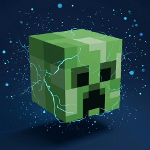

[English](./README.md) | **简体中文**
(简体中文文档可能更新不及时)
# 🧨 CreeperBoom


一款轻量化的 Fabric 模组。当玩家被高压苦力怕（Charged Creeper）炸死时，掉落其对应的玩家头颅。(现在它可以控制苦力怕的爆炸行为了)


[](https://modrinth.com/mod/creeperboom)

---

## 📖 简介

在原版生存中，高压苦力怕可以使僵尸、骷髅等生物掉落头颅，但玩家却无法通过这种方式获得自己的头颅。

**CreeperBoom** 解决了这个问题：当玩家被高压苦力怕击杀时，会原地掉落一个带有该玩家皮肤纹理的头颅。

### 🌟 为什么写这个 Mod？
因为我翻遍了社区，也没找到一个在1.21.4实现“高压苦力怕击败玩家掉落玩家头颅”和“苦力怕防爆”的模组，所以只能自己写了。

---

## ⚙️ 配置说明

首次运行后，模组会在 `.minecraft/config/` 目录下生成配置文件 `creeper.json`。

```json
{
  "dropChance": 1.0,
  "preventBlockDamage": true
}
```

- **dropChance**: 掉落概率。
  - **取值范围**: `0.1` - `1.0` (对应 10%-100%)。
  - **默认值**: `1.0` (100% 掉落)。
- **preventBlockDamage**: 防爆开关
  - **范围**: `true` 或 `fasle`.
  - **默认值**: `true`.

---

## 构建与多版本适配

使用 JDK 25 运行 Gradle，并安装 JDK 21 供 1.21.x 编译工具链使用。
采用与 EasyBotMod 类似的 Stonecutter 结构：共用根目录 `src/`，
按加载器使用构建脚本，按 `versions/<Minecraft版本>-<加载器>/gradle.properties`
配置依赖。

| Fabric 目标版本 | Java | 构建方式 |
| --- | --- | --- |
| 1.21.3、1.21.4、1.21.8、1.21.11 | 21 | Mojang 映射及重映射打包 |
| 26.1.2、26.2、26.3 | 25 | 无混淆打包 |

仅面向表中列出的版本，不包含中间所有版本。

```sh
# 构建全部已配置目标，将发布包和源码包汇总到根目录 build/libs/
./gradlew buildAndCollect
# 单独构建或运行指定版本
./gradlew :1.21.4-fabric:build
./gradlew :1.21.4-fabric:runServer
# 切换共享源码和 IDE 的开发目标
./gradlew "Set active project to 1.21.4-fabric"
```

Windows 使用 `./gradlew.bat`。产物名称包含 Minecraft 版本与加载器，
例如 `CreeperBoom-1.1+mc1.21.4-fabric.jar`。

新增版本时，在 `settings.gradle.kts` 注册目标，复制基线版本的配置并调整
Minecraft、Fabric API 和 Java 版本（Loader 在根配置中统一指定，也可按目标覆盖）。源码中的 API 差异使用
Stonecutter 条件注释处理，再分别编译与游戏内验证。重点检查玩家头颅的
NBT/数据组件写法，以及苦力怕爆炸 Mixin 的调用描述符。提交代码时将开发目标
切回 `1.21.4-fabric`，与 `vcsVersion` 保持一致。

## 📥 下载

推荐前往 [Modrinth](https://modrinth.com/mod/creeperboom) 获取正式版本。

## 🐞 反馈与联系

如果你在爆炸中发现了任何 Bug，欢迎联系我：
- **Email**: connect@baizhouzi.top
- **GitHub**: 直接在仓库提交 Issues。

## 🧠 预计更新计划
~~添加防止苦力怕爆炸破坏方块的功能~~(已在v1.1完成)
