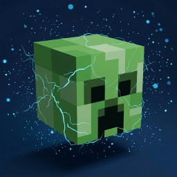

**English** | [简体中文](./README-zh_CN.md)
# 🧨 CreeperBoom


A lightweight Fabric mod that allows players to drop their own heads when killed by a Charged Creeper.
(Now it can control the behavior of Creepers after exploding)


[](https://modrinth.com/mod/creeperboom)

---

## 📖 Description

In vanilla survival, Charged Creepers can cause zombies, skeletons, and other mobs to drop their heads, but players are excluded from this mechanic.

**CreeperBoom** fixes this: when a player is killed by a Charged Creeper, a player head with their unique skin texture will drop at the location.

### 🌟 Why did I create this Mod?
I searched through the community and couldn't find a mod that *only* implements "dropping player heads via Charged Creepers" and "prevent Creeper explosions from destroying blocks" without adding extra bloat, so I decided to write it myself.

---

## ⚙️ Configuration

After the first run, the mod will generate a configuration file named `creeper.json` in the `.minecraft/config/` directory.

```json
{
  "dropChance": 1.0,
  "preventBlockDamage": true
}
```

- **dropChance**: The probability of the head dropping.
  - **Range**: `0.1` - `1.0` (corresponds to 10% - 100%).
  - **Default**: `1.0` (100% drop rate).
- **preventBlockDamage**: Prevent Creeper explosions from destroying blocks.
  - **Range**: `true` or `fasle`.
  - **Default**: `true` .

---

## 📥 Download

It is recommended to get the official release from [Modrinth](https://modrinth.com/mod/creeperboom).

## 🐞 Feedback & Contact

If you find any bugs during the explosion, feel free to contact me:
- **Email**: connect@baizhouzi.top
- **GitHub**: Submit an Issue directly on the repository.

## 🧠 Planned Updates
~~- Add a feature to prevent Creepers from destroying blocks upon explosion.~~(Completed in v1.1)
